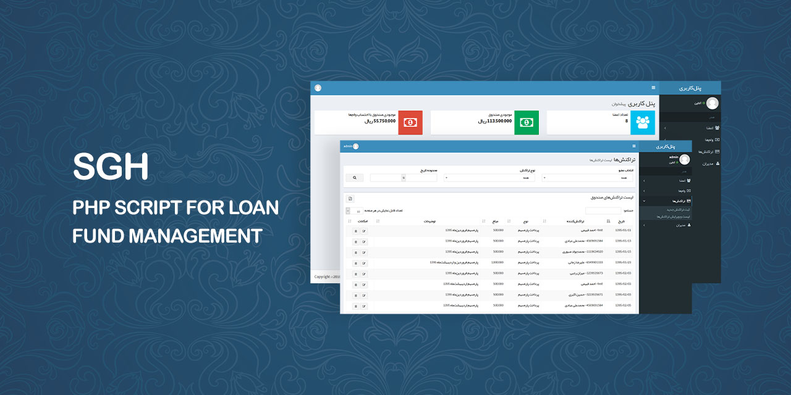

# SGH

PHP Script For Loan Fund Management

This is a Persian PHP script for accounting and financial management of loan funds. It generates PDF reports for you to facilitate the work.

## How To Use?
That's so simple. Just edit the `config.php` file and upload the contents of `src` folder to your host.
The default username and password for admin page is `admin`. After the first login, change it.

## Demo
The demo restores once a day.

[**Member Page**](https://geraked.ir/portfolio/scripts/sgh)
username: test
password: test

[**Admin Page**](https://geraked.ir/portfolio/scripts/sgh/admin)
username: admin
password: admin

## Author
**Rabist** - view on [LinkedIn](https://www.linkedin.com/in/rabist)

## License
Licensed under [MIT](LICENSE).